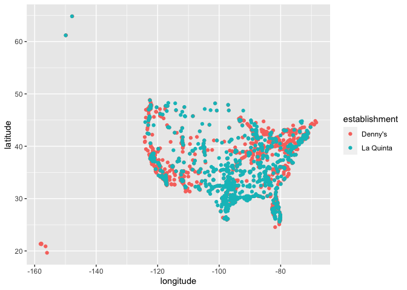
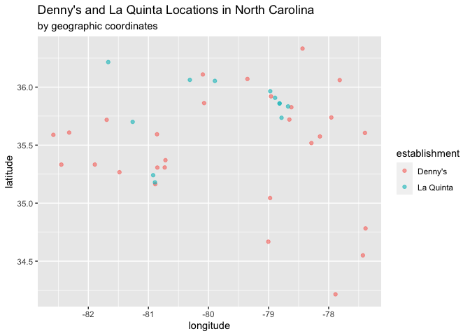
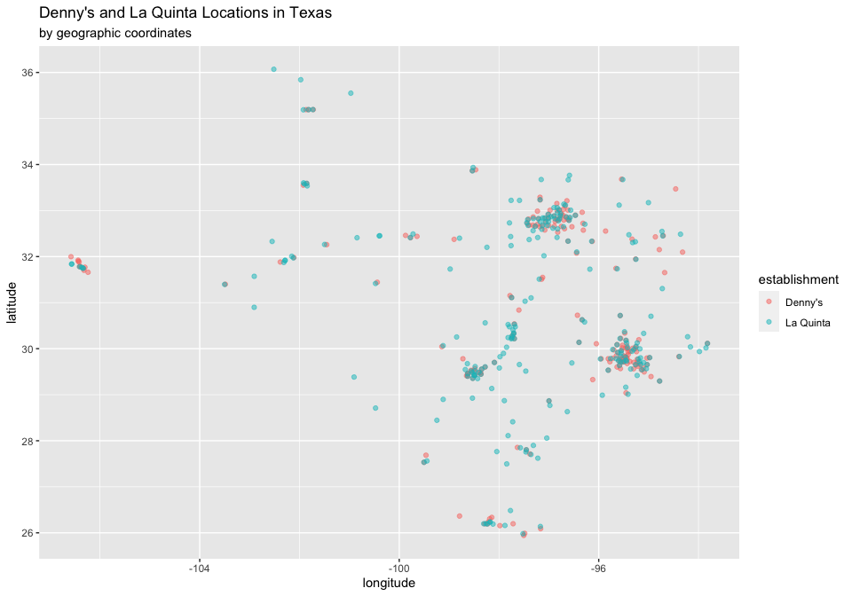

Lab 04 - La Quinta is Spanish for next to Denny’s, Pt. 1
================
Rowan Kemmerly
2.7.23

### Load packages and data

``` r
# install.packages("devtools")
devtools::install_github("rstudio-education/dsbox")
```

    ## Skipping install of 'dsbox' from a github remote, the SHA1 (8fd2a47f) has not changed since last install.
    ##   Use `force = TRUE` to force installation

``` r
library(tidyverse) 
library(dsbox) 
```

``` r
states <- read_csv("data/states.csv")
```

### Exercise 1

``` r
glimpse(dennys)
```

    ## Rows: 1,643
    ## Columns: 6
    ## $ address   <chr> "2900 Denali", "3850 Debarr Road", "1929 Airport Way", "230 …
    ## $ city      <chr> "Anchorage", "Anchorage", "Fairbanks", "Auburn", "Birmingham…
    ## $ state     <chr> "AK", "AK", "AK", "AL", "AL", "AL", "AL", "AL", "AL", "AL", …
    ## $ zip       <chr> "99503", "99508", "99701", "36849", "35207", "35294", "35056…
    ## $ longitude <dbl> -149.8767, -149.8090, -147.7600, -85.4681, -86.8317, -86.803…
    ## $ latitude  <dbl> 61.1953, 61.2097, 64.8366, 32.6033, 33.5615, 33.5007, 34.206…

The Denny’s dataset has 1643 rows and 6 columns: each row represents a
Denny’s location, and each column represents the 6 variables of location
street address, city, state, zip code, longitude, and latitude.

### Exercise 2

``` r
glimpse(laquinta)
```

    ## Rows: 909
    ## Columns: 6
    ## $ address   <chr> "793 W. Bel Air Avenue", "3018 CatClaw Dr", "3501 West Lake …
    ## $ city      <chr> "\nAberdeen", "\nAbilene", "\nAbilene", "\nAcworth", "\nAda"…
    ## $ state     <chr> "MD", "TX", "TX", "GA", "OK", "TX", "AG", "TX", "NM", "NM", …
    ## $ zip       <chr> "21001", "79606", "79601", "30102", "74820", "75254", "20345…
    ## $ longitude <dbl> -76.18846, -99.77877, -99.72269, -84.65609, -96.63652, -96.8…
    ## $ latitude  <dbl> 39.52322, 32.41349, 32.49136, 34.08204, 34.78180, 32.95164, …

The La Quinta dataset has 909 rows and 6 columns: each row represents a
La Quinta location, and each column represents the 6 variables of
location street address, city, state, zip code, longitude, and latitude.

### Exercise 3

There are 17 La Quinta locations outside of the United States in Canada,
Mexico, China, New Zealand, Turkey, United Arab Emirates, Chile, and
Colombia. There are no Denny’s locations outside of the US.

### Exercise 4

``` r
view(laquinta)
view(dennys)
```

To find out whether La Quinta or Denny’s have locations outside of the
US using the dataset, you could filter for states that are not one of
the abbreviations of 50 (51) US states. That could probably be done
using the help of our “states” dataset!

### Exercise 5

Seeing whether there are Denny’s locations outside of the US with code:

``` r
dennys %>%
  filter(!(state %in% states$abbreviation))
```

    ## # A tibble: 0 × 6
    ## # … with 6 variables: address <chr>, city <chr>, state <chr>, zip <chr>,
    ## #   longitude <dbl>, latitude <dbl>

Confirmed that there are no Denny’s locations outside of the US!

### Exercise 6

Adding a “country” variable to the Denny’s dataset:

``` r
dennys %>%
  mutate(country = "United States")
```

    ## # A tibble: 1,643 × 7
    ##    address                        city       state zip   longi…¹ latit…² country
    ##    <chr>                          <chr>      <chr> <chr>   <dbl>   <dbl> <chr>  
    ##  1 2900 Denali                    Anchorage  AK    99503  -150.     61.2 United…
    ##  2 3850 Debarr Road               Anchorage  AK    99508  -150.     61.2 United…
    ##  3 1929 Airport Way               Fairbanks  AK    99701  -148.     64.8 United…
    ##  4 230 Connector Dr               Auburn     AL    36849   -85.5    32.6 United…
    ##  5 224 Daniel Payne Drive N       Birmingham AL    35207   -86.8    33.6 United…
    ##  6 900 16th St S, Commons on Gree Birmingham AL    35294   -86.8    33.5 United…
    ##  7 5931 Alabama Highway, #157     Cullman    AL    35056   -86.9    34.2 United…
    ##  8 2190 Ross Clark Circle         Dothan     AL    36301   -85.4    31.2 United…
    ##  9 900 Tyson Rd                   Hope Hull… AL    36043   -86.4    32.2 United…
    ## 10 4874 University Drive          Huntsville AL    35816   -86.7    34.7 United…
    ## # … with 1,633 more rows, and abbreviated variable names ¹​longitude, ²​latitude

### Exercise 7

Seeing whether there are La Quinta locations outside of the US with
code:

``` r
laquinta %>%
  filter(!(state %in% states$abbreviation))
```

    ## # A tibble: 14 × 6
    ##    address                                     city  state zip   longi…¹ latit…²
    ##    <chr>                                       <chr> <chr> <chr>   <dbl>   <dbl>
    ##  1 Carretera Panamericana Sur KM 12            "\nA… AG    20345  -102.    21.8 
    ##  2 Av. Tulum Mza. 14 S.M. 4 Lote 2             "\nC… QR    77500   -86.8   21.2 
    ##  3 Ejercito Nacional 8211                      "Col… CH    32528  -106.    31.7 
    ##  4 Blvd. Aeropuerto 4001                       "Par… NL    66600  -100.    25.8 
    ##  5 Carrera 38 # 26-13 Avenida las Palmas con … "\nM… ANT   0500…   -75.6    6.22
    ##  6 AV. PINO SUAREZ No. 1001                    "Col… NL    64000  -100.    25.7 
    ##  7 Av. Fidel Velazquez #3000 Col. Central      "\nM… NL    64190  -100.    25.7 
    ##  8 63 King Street East                         "\nO… ON    L1H1…   -78.9   43.9 
    ##  9 Calle Las Torres-1 Colonia Reforma          "\nP… VE    93210   -97.4   20.6 
    ## 10 Blvd. Audi N. 3 Ciudad Modelo               "\nS… PU    75010   -97.8   19.2 
    ## 11 Ave. Zeta del Cochero No 407                "Col… PU    72810   -98.2   19.0 
    ## 12 Av. Benito Juarez 1230 B (Carretera 57) Co… "\nS… SL    78399  -101.    22.1 
    ## 13 Blvd. Fuerza Armadas                        "con… FM    11101   -87.2   14.1 
    ## 14 8640 Alexandra Rd                           "\nR… BC    V6X1…  -123.    49.2 
    ## # … with abbreviated variable names ¹​longitude, ²​latitude

So it looks like this dataset only contains 14 of La Quinta’s
international locations. The ones in this dataset are located in Mexico
(10 locations, 1 of which is now permanently closed, and 3 of which are
now CHN hotels instead), Colombia, Honduras, and Canada (2 locations):

Carretera Panamericana Sur KM 12 (Mexico) Av. Tulum Mza. 14 S.M. 4 Lote
2 (Mexico, permanently closed) Ejercito Nacional 8211 (Mexico) Blvd.
Aeropuerto 4001 (Mexico) Carrera 38 \# 26-13 Avenida las Palmas con Loma
de San Julian El Poblado (Colombia) AV. PINO SUAREZ No. 1001 (Mexico)
Av. Fidel Velazquez \#3000 Col. Central (Mexico) 63 King Street East
(Canada) Calle Las Torres-1 Colonia Reforma (Mexico) Blvd. Audi N. 3
Ciudad Modelo (Mexico) Ave. Zeta del Cochero No 407 (Mexico) Av. Benito
Juarez 1230 B (Carretera 57) Col. Valle Dorado Zona Hotelera (Mexico)
Blvd. Fuerza Armadas (Honduras) 8640 Alexandra Rd (Canada)

### Exercise 8

Now I’m adding a “country” variable based on state abbreviations for
each case.

``` r
laquinta <- laquinta %>%
  mutate(country = case_when(
    state %in% state.abb     ~ "United States",
    state %in% c("ON", "BC") ~ "Canada",
    state == "ANT"           ~ "Colombia",
    state == "FM"            ~ "Honduras",
    state %in% c("AG","QR", "CH", "NL", "VE","PU","SL") ~ "Mexico"
  ))
```

Now I’m filtering the La Quinta dataset for just locations that are in
the US.

``` r
laquinta <- laquinta %>%
  filter(country == "United States")
```

### Exercise 9

Let’s now look at how many Denny’s and La Quintas are in each state!

``` r
dn_freq <- dennys %>%
  count(state) %>%
  inner_join(states, by = c("state" = "abbreviation")) %>%
  arrange(desc(n))
```

``` r
lq_freq <- laquinta %>%
  count(state) %>%
  inner_join(states, by = c("state" = "abbreviation")) %>%
  arrange(name)
```

So it looks like California has the most Denny’s locations (makes sense,
since it’s such a large state), and Delaware has the least (which also
makes sense, since it’s such a small state). For La Quinta locations,
Texas has by far the most (not entirely sure why that’s the case) and
Delaware, Hawaii, and DC all have the least (since they all have 0
locations and aren’t in this data frame — Maine has 1).

### Exercise 10

First I’m creating a new data frame that has both the Denny’s and La
Quinta data.

``` r
dn <- dennys %>%
  mutate(establishment = "Denny's")
lq <- laquinta %>%
  mutate(establishment = "La Quinta")

dn_lq <- bind_rows(dn, lq)
```

``` r
ggplot(dn_lq, aes(x = longitude,
                  y = latitude,
                  color = establishment)) +
  geom_point()
```

<!-- -->

Wow, it’s the shape of the US!

I’m going to compute a new variable to determine which states have the
most Denny’s and La Quinta locations per thousand square miles.

``` r
dn_freq %>%
  mutate(per1000sqmi = (n/area)*1000) %>%
  arrange(desc(per1000sqmi))
```

    ## # A tibble: 51 × 5
    ##    state     n name                     area per1000sqmi
    ##    <chr> <int> <chr>                   <dbl>       <dbl>
    ##  1 DC        2 District of Columbia     68.3      29.3  
    ##  2 RI        5 Rhode Island           1545.        3.24 
    ##  3 CA      403 California           163695.        2.46 
    ##  4 CT       12 Connecticut            5543.        2.16 
    ##  5 FL      140 Florida               65758.        2.13 
    ##  6 MD       26 Maryland              12406.        2.10 
    ##  7 NJ       10 New Jersey             8723.        1.15 
    ##  8 NY       56 New York              54555.        1.03 
    ##  9 IN       37 Indiana               36420.        1.02 
    ## 10 OH       44 Ohio                  44826.        0.982
    ## # … with 41 more rows

``` r
lq_freq %>%
  mutate(per1000sqmi = (n/area)*1000) %>%
  arrange(desc(per1000sqmi))
```

    ## # A tibble: 48 × 5
    ##    state     n name             area per1000sqmi
    ##    <chr> <int> <chr>           <dbl>       <dbl>
    ##  1 RI        2 Rhode Island    1545.       1.29 
    ##  2 FL       74 Florida        65758.       1.13 
    ##  3 CT        6 Connecticut     5543.       1.08 
    ##  4 MD       13 Maryland       12406.       1.05 
    ##  5 TX      237 Texas         268596.       0.882
    ##  6 TN       30 Tennessee      42144.       0.712
    ##  7 GA       41 Georgia        59425.       0.690
    ##  8 NJ        5 New Jersey      8723.       0.573
    ##  9 MA        6 Massachusetts  10554.       0.568
    ## 10 LA       28 Louisiana      52378.       0.535
    ## # … with 38 more rows

DC has the most Denny’s per 1000 square miles, and Rhode Island has the
most La Quintas per square 1000 miles!

### Exercise 11

Looking at North Carolina Denny’s and La Quintas:

``` r
dn_lq_nc <- filter(dn_lq, state == "NC")

nc_plot <- ggplot(dn_lq_nc, aes(x = longitude,
                  y = latitude,
                  color = establishment)) +
  geom_point(alpha = .6) +
  labs(title = "Denny's and La Quinta Locations in North Carolina", subtitle = "by geographic coordinates")

nc_plot
```

<!-- -->

I would say that, for the most part, all but one of the La Quinta
locations in NC are quite close to a Denny’s.

### Exercise 12

Looking at Texas Denny’s and La Quintas:

``` r
dn_lq_tx <- filter(dn_lq, state == "TX")

tx_plot <- ggplot(dn_lq_tx, aes(x = longitude,
                  y = latitude,
                  color = establishment)) +
  geom_point(alpha = .5) +
  labs(title = "Denny's and La Quinta Locations in Texas", subtitle = "by geographic coordinates")

tx_plot
```

<!-- -->

Woah, the joke definitely seems to hold for Texas! Almost all of the
Denny’s locations are very close to a La Quinta (though there are plenty
of La Quinta locations that don’t have a Denny’s nearby).
